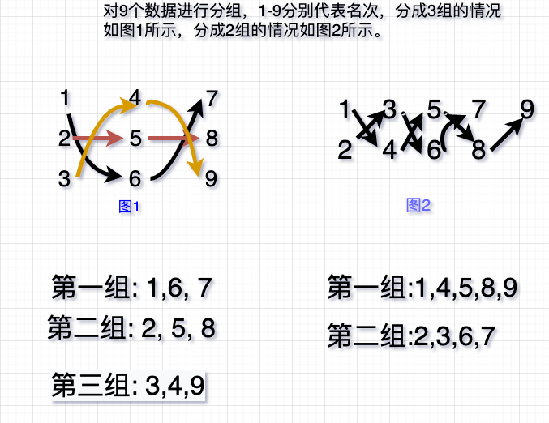
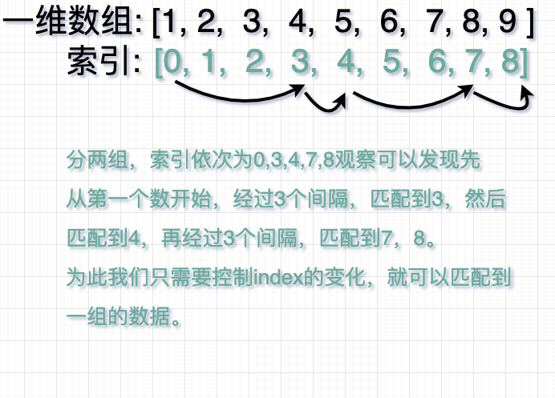
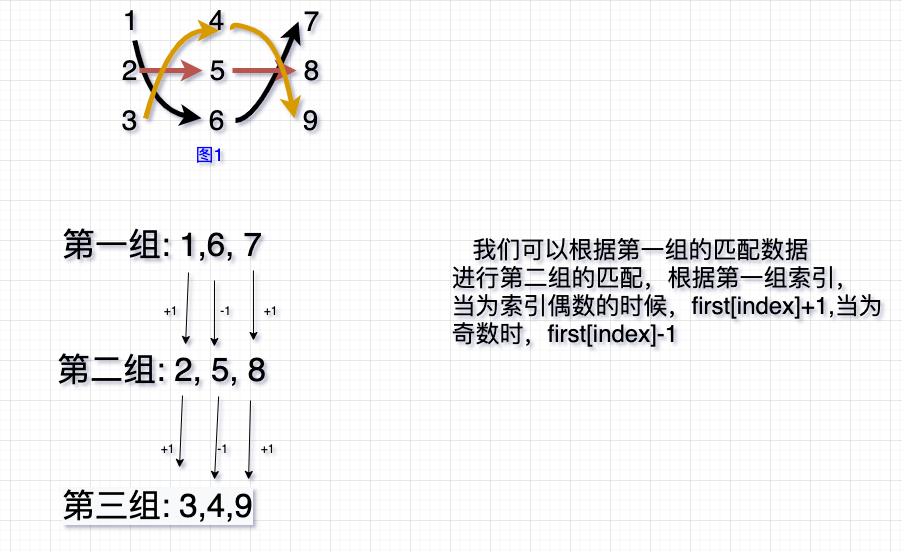

# 蛇形分组与龙舟分道

## 业务描述

分组的方式在竞技比赛中至关重要，事关公平以及比赛的观赏性，为此我们需要一个 较公平的分组方式，把一组运动员，根据组数，以及成绩排名，分成每组水平相当的队伍集合。蛇形分组就是其中之一的方式。它的分配规则如下：根据需排的组数,按蛇行走向将运动员排列分成不同的小组。如下
所示就是我们所需要的分配方式。



## 算法实现思想

1. 构造第一分组
2. 根据第一分组与剩下的分组规则，构造剩下的分组.

经过观察分配方式，我们得知一个规律，分配的第一组的名次之间的索引存在一下规律。拿上图例子来说明，数据存储为一维数组`[1,2,3,4,5,6,7,8,9]`,如分配 2 组，则第一组的分配数据为[1,4,5,8,9]。如下所示:


故获得第一分组的匹配代码如下所示

```js
function generateFirstGroup(arr, groupNumber) {
  let index = 0;

  let group = [];
  let flag = true;

  while (index < arr.length) {
    group.push(arr[index]);
    index = flag ? index + (groupNumber * 2 - 1) : index + 1;
    flag = !flag;
  }

  return group;
}
```

通过观察，发现第一组和剩下的分组之间的关系如下：上一位数的概念。



## 算法实现

```js
function generateSnakePosition(arr, groupNumber) {
  // 处理原始数据，补成 groupNumber 和 arr 的倍数
  const max = arr.at(-1);
  let copy = max;
  while (copy % groupNumber != 0) {
    arr.push(++copy);
  }

  let res = [];
  let temp = [];
  let currentGroup = 1;
  let last = generateFirstGroup(arr, groupNumber);
  res.push(last);
  // 上一位数的概念?
  while (currentGroup < groupNumber) {
    for (let i = 0; i < last.length; i++) {
      if (i % 2 === 0) {
        temp.push(last[i] + 1);
      } else {
        temp.push(last[i] - 1);
      }
    }

    res.push(temp);
    // 重置
    last = temp.slice();

    temp = [];
    currentGroup++;
  }
  // 过滤掉大于
  return res.map((item) => item.filter((item) => item <= max));
}
console.log(generateSnakePosition([7, 8, 9, 10, 11, 12, 13, 14], 3));
```

## 测试

前提条件，数据输入,名次必须是连续的,[1,3,5，7,8]不合规数据

## 参考

- https://zhidao.baidu.com/question/173962846.html
